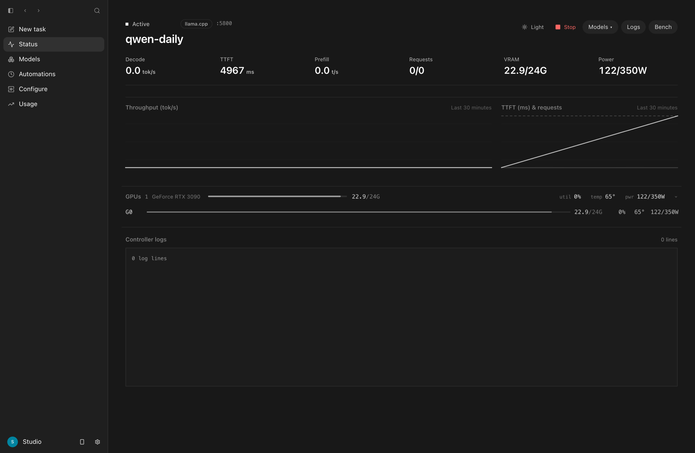
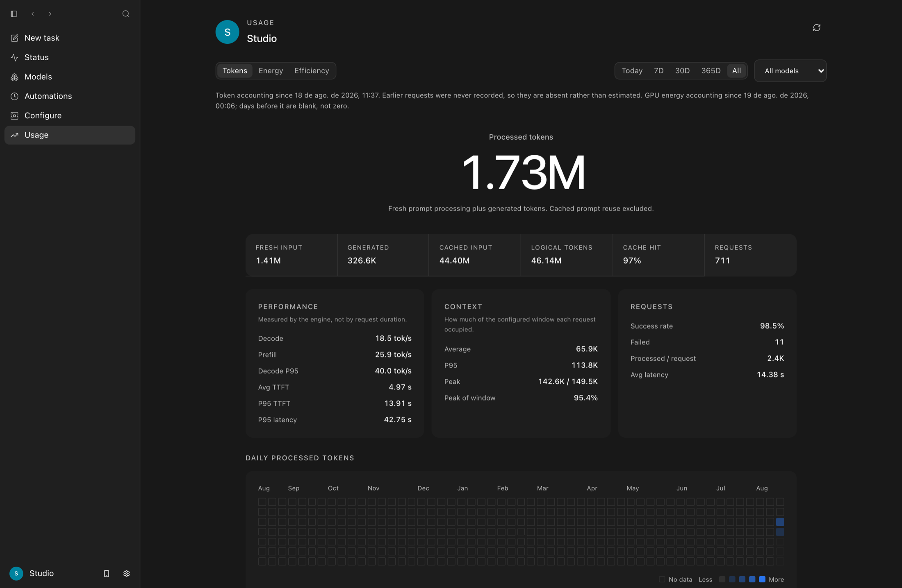
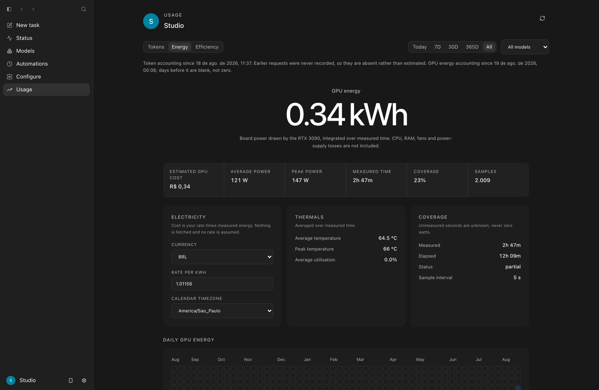
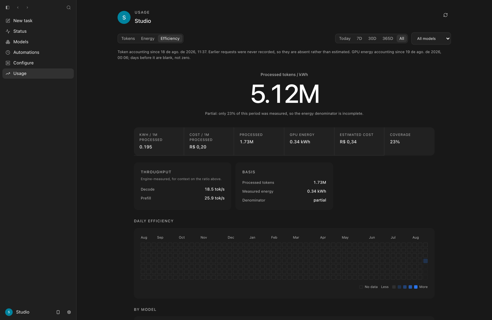
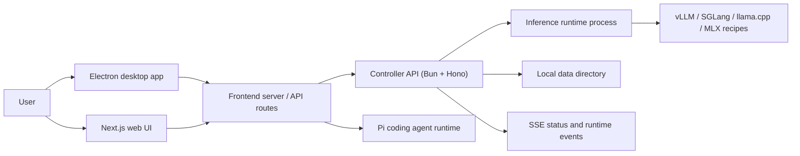
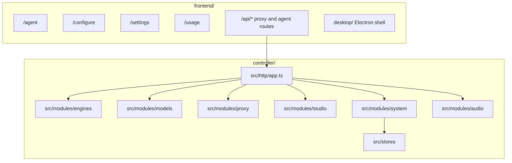

# CRIAs AI

CRIAs AI is a local-first workstation for running, managing, and using
self-hosted LLM backends. One machine can launch models, watch GPU/runtime
state, chat with OpenAI-compatible endpoints, and run agent sessions against
local or remote controllers. Version 2.0 unifies day-to-day operation around
Status, Workbench, Configure, and Usage instead of separate model, integration,
and server surfaces.

## Download

> **This repository is a customised fork.** The link below is the **upstream**
> build from `sybil-solutions/local-studio`. Installing it over a build made from
> this fork replaces CRIAs AI with stock Local Studio — see
> [`docs/upstream-updates.md`](docs/upstream-updates.md). This fork publishes no
> binary of its own; you build it locally with `npm run desktop:dist`.

**[Download upstream Local Studio for macOS (Apple Silicon)](https://github.com/sybil-solutions/local-studio/releases/latest/download/Local-Studio-arm64.dmg)**
— upstream's build: signed, notarized, and self-updating from upstream releases.
All upstream versions on the
[releases page](https://github.com/sybil-solutions/local-studio/releases), or via
[localstudio.ai](https://localstudio.ai).

## What this fork adds

This fork drives a private RTX 3090 rig over Tailscale — see
[`matheusbgodoi/local-ai-3090-stack`](https://github.com/matheusbgodoi/local-ai-3090-stack).
Everything below is live data from that machine, not a mockup.

### Status reads the real rig



The resident model, its context window and port come from the running process;
VRAM, utilisation, temperature and power come from the driver. Nothing here is a
UI constant, and a sensor the board does not report is shown as unavailable
rather than as a real zero.

### Usage — Tokens



Usage was rebuilt as three tabs over a shared period and model filter, and the
headline number changed. It used to lead with the total prompt tokens proxied —
a true reading that misled, because on a long agentic session the conversation is
resent every turn and most of that total is prompt the GPU **re-read from cache
and never recomputed**. Above: 44.40M of 46.14M was cache reuse; **1.73M was
actually processed**.

| Shown                | Means                                                       |
| -------------------- | ----------------------------------------------------------- |
| **Processed tokens** | fresh prompt evaluation + generated. The headline.          |
| Fresh input          | prompt tokens the engine actually evaluated                 |
| Cached input         | prompt tokens reused from the KV cache                      |
| Logical tokens       | total context traffic, cache included — real, but secondary |

Throughput comes from llama.cpp's own `timings`, never from HTTP duration, and
context pressure is measured against the resident server's own window — above,
a peak of **142.6K of 149.5K**.

### Usage — Energy



**GPU board energy**, sampled from NVML every 5 seconds on the host and
integrated over measured time. Not the CPU, RAM, fans, power-supply losses or the
wall — the page says so under the number.

Absence of measurement is not zero watts: a gap is skipped rather than bridged,
and every bucket reports the coverage behind it. Days before the sampler existed
have no square at all. Currency, tariff and calendar timezone are yours; **no
cost is ever stored**, so correcting the rate re-prices all of history at once.

### Usage — Efficiency



Processed tokens per kWh, kWh per million, and cost per million at your rate.
It is computed only when both halves exist, and says so when energy coverage for
the period is thin rather than presenting a partly measured denominator as exact.

### Web search, without a key

`browser_search` returns ranked results from DuckDuckGo's no-JavaScript HTML
frontend, with its Lite frontend as a single fallback — **no API key, no account,
no container, no daemon**. It returns discovery only; the model picks one to three
results and reads those. Reading is reader-first, falling back to the rendered
browser only when a page genuinely needs JavaScript.

When a site asks for a human, this fork **detects it and stops** — no retry loop,
no user-agent shuffling, no proxy — and hands the page to you in a visible window
on the same browser profile. Human verification is supported;
**automated CAPTCHA bypass is not implemented**.

### Runs that survive their own compaction

Write an ordinary prompt. The served model decides for itself whether that is a
question or a piece of durable work, and if it is work it plans it, creates the
**Run**, its **Tasks** and its **Agents**, and gets on with it — you watch,
rather than issuing commands. The plan appears live in the chat that started it.

Runs, Tasks and Agents are durable records outside the model's context, so a
compaction checkpoints, rebuilds the working set from the store and schedules
the next inference itself — the same task stays running, and nobody types
"continue". A task completes on acceptance
evidence rather than on the word "done"; repeated non-progress replans within a
bound; a restart preserves finished work and reconciles anything side-effecting
that was in flight instead of replaying it.

Context reserves are fractions of whatever window the serving contract declares,
so a 32K, 176128 or future 1M model needs no code change.

Details: [`docs/durable-agentic-runtime.md`](docs/durable-agentic-runtime.md).

### Lazy tools

Skills load on demand and MCP connectors are armed per chat session rather than
per installation, so a fresh session carries neither in its tool schemas.

Details: [`docs/status-and-usage.md`](docs/status-and-usage.md) and
[`docs/web-search.md`](docs/web-search.md).

### VPN Protected, in place of the Browser toggle

There used to be a per-conversation Browser toggle. It answered the wrong
question: turning the browser off never removed the agent's internet, because
`bash`, `curl`, Python, Node, `git`, `npm`, an API and any MCP connector were all
still there. It described a tool list while appearing to describe a route.

The browser is now an ordinary capability, always available, and the model picks
between it and the shell on the merits — open-ended search wants the browser, a
known JSON endpoint wants `curl`, a dynamic page wants Playwright. The control
that replaced it, in the chat's own session controls, is about routing:

- **Direct** — the machine's normal route.
- **VPN Protected** — agent workloads have no permitted direct path to the
  public internet, and losing the tunnel blocks public egress rather than
  falling back to it.

The boundary is a macOS Seatbelt jail with exactly one permitted destination —
the loopback port sing-box listens on — so fail-closed is structural rather than
a rule that could be misconfigured. It covers the model's shell and everything
it starts, the owner's terminal, local MCP connectors and Chromium (headless,
headful and `browser_verify`). A tunnel is a WireGuard config from any provider;
no vendor API is involved and no key ever leaves the runtime process.

A VPN moves where packets leave from. It does not touch cookies, logins,
fingerprints or tokens, and nothing here claims otherwise.

A Run captures its conversation's policy at birth and keeps it until it ends.
Because the agent-runtime is one process shared by every conversation, isolation
is conservative rather than per-session: while any workload is protected, all
agent traffic is, and the interface says so.

Details, including what is *not* covered:
[`docs/protected-networking.md`](docs/protected-networking.md).

---

It is built from two modules that share one controller API:

- [`controller/`](controller/README.md) — Bun/Hono backend. Owns model lifecycle
  (launch, evict, recipes, downloads, runtime process coordination), an
  OpenAI-compatible proxy (chat, models, tokenization, audio), system state
  (GPU metrics, logs, usage, settings, SSE), and controller integrations.
- [`frontend/`](frontend/README.md) — Next.js 16 + React 19 UI and the macOS
  Electron desktop shell. Hosts the Workbench (`/agent`), consolidated
  Configure surface, settings, usage, logs, and browser-facing API routes.

## Mobile access

CRIAs AI can publish its web interface to devices on the owner's Tailscale
network. The desktop footer exposes the tailnet URL and copies the masked
pairing token without sending the secret to the renderer. Pair once in Safari,
then add CRIAs AI to the iPhone home screen as a PWA.

See [`docs/remote-access.md`](docs/remote-access.md) for setup, authentication,
port recovery, and the boundary between tailnet-only access and public Funnel
exposure.

## What is a controller?

A controller is the backend process the UI talks to — the Bun/Hono
server in `controller/`. You can run one locally or point the frontend at a
remote controller on a GPU host. The controller owns model lifecycle, the
OpenAI-compatible proxy, system state, and SSE event streams.

## Architecture





## Quick start

Prerequisites: Bun 1.3.14+, Node.js 22.19+, npm 10+, Python 3.10+, and Git.
`uv` is strongly recommended; engine installs fall back to pip. vLLM/SGLang
serving on Linux needs NVIDIA driver + CUDA; Apple Silicon uses the MLX backend.

Validate the toolchain, then install every locked workspace dependency from the
repository root:

```bash
npm run doctor
npm run setup
```

Start the controller (listens on `127.0.0.1:8080`, data dir + SQLite created
automatically, model weights in `LOCAL_STUDIO_MODELS_DIR`, default `/models`):

```bash
npm run dev:controller
```

Start the frontend in a second terminal, then open
<http://localhost:3000/setup>:

```bash
npm run dev
```

`npm run setup` installs the controller, shared contracts, agent runtime, and
frontend from their lockfiles. The setup wizard walks through choosing a models
directory, installing an engine, downloading a model, launching it, and
benchmarking. Engine installs (vLLM/SGLang/MLX) land below the data directory at
`runtime/venvs/<backend>-latest`.

## Agent runtime

The agent surface lives at `/agent` in the frontend. It uses
`@earendil-works/pi-coding-agent` through the frontend runtime rather than
shelling out to a separate agent process for normal turns. Agent skills and
extensions are discovered through Pi and surfaced in the session UI. Pi remains
the source of truth for authentication, settings, resources, tools, and native
JSONL sessions. The runtime respects `PI_CODING_AGENT_DIR`,
`PI_CODING_AGENT_SESSION_DIR`, and Pi's `sessionDir` setting in the same
precedence order as the CLI. Existing Local Studio session storage remains a
read-compatible legacy source, while new sessions use Pi's resolved directory.
Workbench sends only the active controller to Pi and shows that controller's
advertised models by default. The model picker has an explicit Other models
switch for models from the user's Pi catalog and providers connected in
Configure. Those opt-in models use Pi's native provider routing without adding
saved inactive controllers to the session.

New Workbench chats start with Pi's `read`, `grep`, `find`, and `ls` tools. Full
access enables every tool registered in that Pi session, including extension
tools. Read only is a model-tool allowlist, not an operating-system sandbox,
and loaded extensions may still have their own behavior. Pi runs with the full
permissions of the host user. Tailscale limits who can reach the dashboard; it
does not sandbox Pi.

## Runtime backends

Recipes launch through the controller runtime layer. Wired backend families:

- `vllm` — vLLM server recipes through configured/discovered/system/Docker/bundled targets.
- `sglang` — SGLang `launch-server` recipes through configured or discovered Python targets.
- `llamacpp` — llama.cpp `llama-server` recipes for GGUF models.
- `mlx` — MLX `mlx_lm.server` recipes for Apple Silicon.

Runtime target discovery, models, integrations, and server controls are
surfaced in Configure; selections persist in the controller data directory.

## Production

Build the frontend, then serve the controller and standalone frontend in separate
terminals:

```bash
npm run build
npm run start:controller
npm run start
```

`npm run start` launches the standalone server through `scripts/project.mjs`.
Never use plain `next start` — it breaks SSE streaming. The controller runs the
same way in production as in development: `bun src/main.ts`.

The production frontend binds only to `127.0.0.1` and defaults to port `4783`.
`PORT` may be set to an integer from 1024 through 65535. Workspace paths are
canonicalized and must be under `WORKSPACE_ROOTS`, a platform-path-delimited
list that defaults to the current user's home directory. Add mounted locations
explicitly, for example `WORKSPACE_ROOTS="$HOME:/Volumes/Projects"` on macOS.

For private mobile access, first configure the exact Serve hostname:

```bash
cd frontend
ALLOWED_TAILSCALE_HOSTS=studio.example.ts.net npm start
tailscale serve --bg http://127.0.0.1:4783
tailscale serve status
```

Serve supplies a private HTTPS tailnet URL. Both devices must be in the intended
tailnet, and ACLs or grants should restrict the URL to its owner. Do not use
Tailscale Funnel. `tailscale serve --bg` persists the proxy configuration across
Tailscale restarts and reboots; it does not start Local Studio. Optionally set
`ALLOWED_TAILSCALE_USERS` to a comma-separated login allowlist. The
`Tailscale-User-Login` header is trusted only because the backend remains bound
to loopback behind Serve.

Manual availability requires `npm start` to remain active. An OS-native user
service can start the compiled app after login and restart it after a crash, but
it is intentionally not installed automatically. The host must still be on,
awake, online, and connected to Tailscale.

## Remote / LAN deployment

The controller binds `127.0.0.1` by default. Binding a non-loopback host (e.g.
`LOCAL_STUDIO_HOST=0.0.0.0`) requires `LOCAL_STUDIO_API_KEY` — startup throws
without it. On a trusted LAN you may instead set
`LOCAL_STUDIO_ALLOW_UNAUTHENTICATED=true` to opt out of authentication.

Point the frontend at a remote controller with `BACKEND_URL` or
`NEXT_PUBLIC_API_URL` (default `http://localhost:8080`).

Deploy with your normal SSH or infrastructure workflow. The repository does not
maintain a second deployment wrapper alongside the controller installer.

The controller installer registers a persistent user service automatically
(`launchd` on macOS and `systemd --user` on Linux), so installed controllers
return after login without a repository daemon wrapper.

## Validation

```bash
npm run check
```

The configured pre-push hook (`.githooks/pre-push`) checks conventional commits
and runs the frontend quality gate before pushing. The hook filenames are
symlinks to `scripts/project.mjs`; they do not contain separate automation logic.

## Releases

Every successful `main` CI run builds an unsigned macOS app and keeps the
exact-SHA package as a GitHub Actions artifact. Conventional commits
then trigger `release.yml`. Semantic Release chooses the next version (`feat` →
minor, breaking → major, all other allowed commit types → patch).

The release workflow builds the exact revision without Apple credentials,
then passes only that unsigned app bundle to a separate signing job. The signing
job installs the lockfile-pinned signing tooling without lifecycle scripts,
signs, notarizes and staples the release assets, and hands them to a final
publish job. Each stage rechecks that its revision is still `origin/main`; only
the final stage can create the GitHub release with the DMG, updater files,
stable website alias, checksums, and source manifest. There is no npm publish
and tags are never created by hand.

## Acknowledgements

CRIAs AI is built with and inspired by exceptional open-source work:

- [DuckDuckGo](https://duckduckgo.com) — this fork's `browser_search` reads
  DuckDuckGo's public no-JavaScript HTML frontends. They are web pages, not a
  supported API; DuckDuckGo is not affiliated with this project and does not
  endorse it.

- [Pi](https://github.com/earendil-works/pi) — the agent runtime and native
  session model behind Workbench.
- [T3 Code](https://github.com/pingdotgg/t3code) — inspiration for a focused,
  developer-first coding workbench.
- [SGLang](https://github.com/sgl-project/sglang) — a high-performance model
  serving backend supported by CRIAs AI recipes.
- [vLLM](https://github.com/vllm-project/vllm) — a high-throughput inference
  and serving backend supported throughout CRIAs AI.
- [Convex](https://github.com/get-convex/convex-backend) — inspiration for
  reactive, real-time application architecture.

## Contributing

Contributions should be small, focused, and easy to review. Start from the
latest `dev`, one logical change per branch, no formatting-only rewrites, no
secrets or build artifacts. Run `npm run check` before opening a PR; include a concise summary, the validation
commands you ran, and screenshots for UI changes. See AGENTS.md for the full
code standards an agent (or contributor) must follow.

## License

Apache License 2.0 — see [LICENSE](LICENSE), `Copyright 2025 0xSero`.

This fork modifies that work; the modifications are listed in [NOTICE](NOTICE)
as Apache-2.0 section 4(b) requires. The upstream licence and copyright are
unchanged and travel with every copy.

## Owner fork notes

This repository is a customised fork of
[`sybil-solutions/local-studio`](https://github.com/sybil-solutions/local-studio),
cut from upstream **2.1.0**. Current owner build:
**[`v2.1.0-local.1`](https://github.com/matheusbgodoi/local-studio/releases/tag/v2.1.0-local.1)**
— source only, built locally, ad-hoc signed. Every modification is listed in
[`NOTICE`](NOTICE) as Apache-2.0 requires.

Three things behave differently from upstream and are documented separately:

- **[`docs/upstream-updates.md`](docs/upstream-updates.md)** — the app never
  replaces itself with an upstream artefact. Upgrading is a deliberate merge into
  this fork followed by a local rebuild.
- **[`docs/status-and-usage.md`](docs/status-and-usage.md)** — Status and Usage
  read the same remote controller that serves Chat, with no demo data anywhere.
- **[`docs/web-search.md`](docs/web-search.md)** — `browser_search`, reader-first
  research, and the human-verification path for sites that ask for a person.
- **[`docs/durable-agentic-runtime.md`](docs/durable-agentic-runtime.md)** — the
  durable Run/Task/Agent runtime: schema, scheduler, context budget, compaction,
  recovery, idempotency, and why a bigger model needs no code change.

The rig this fork is built to drive, and the project it belongs to, is
[`matheusbgodoi/local-ai-3090-stack`](https://github.com/matheusbgodoi/local-ai-3090-stack).
