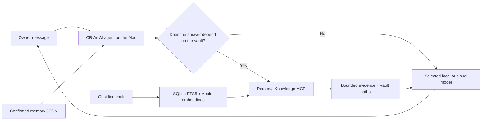

# Personal memory and Obsidian Knowledge

CRIAs AI uses two complementary context layers. Personal memory is the small,
explicit set of preferences the owner wants available repeatedly. Knowledge is a
retrieval layer over the owner's Obsidian vault. They solve different problems and
neither one retrains the language model.

## The flow



The Mac remains the orchestrator. The MCP reads and ranks local files, then the
agent sends only the selected context to the chosen model. A model on the RTX 3090
does not mount the vault or run the MCP itself.

## Personal memory

Settings → Memory exposes the complete owner control surface:

- Off or Automatic mode;
- add a memory manually;
- edit its text, category and sensitivity;
- pause an item without deleting it;
- delete one item;
- select and delete several items;
- forget everything with a confirmation that explains chat and Obsidian remain;
- see whether it was manually added or confirmed in a conversation.

The agent tool `remember_personal_detail` proposes a short durable preference or
working style. It cannot persist anything when memory is off, when the proposal is
empty, or when an owner-confirmation UI is unavailable. A visible confirmation is
required before the store changes. Retrieved documents, web pages, secrets, health
data and temporary tasks are not valid memory proposals.

The v1 limits are intentionally small:

- 60 items;
- 280 characters per item;
- 2,000 total characters in the injected prompt block.

The data lives at `personal-memory.json` inside Electron's user-data directory. In
the production macOS app that is:

```text
~/Library/Application Support/Local Studio/personal-memory.json
```

Writes are serialized, atomic and use file mode `0600`. The document starts with
memory and Knowledge off unless the owner changes the settings. No initial facts
are inferred or imported automatically.

### Sensitivity

Standard items may be used with the selected provider. Local-only items are
injected only when the controller URL proves a loopback, RFC1918/private, CGNAT or
Tailscale destination. They remain stored and editable but are excluded from cloud
model prompts.

This boundary controls future prompt injection. A detail already stated in a cloud
conversation has already reached that provider; marking it local-only cannot undo
the current conversation.

## Obsidian Knowledge modes

Knowledge has three global modes for new conversations:

| Mode | Behavior |
| --- | --- |
| Off | Do not select the personal Knowledge connector automatically. |
| Automatic | Select it for the conversation and use it when the answer depends on the owner's vault. |
| Always cite | For claims about the owner, studies, companies or projects, investigate the vault and cite returned paths; state when evidence is missing. |

`/mcp knowledge`, `/mcp off knowledge` and `/mcp off` remain explicit per-chat
overrides. Changing the global setting affects new runtime sessions; an explicit
conversation selection wins.

The connector ID is `personal-knowledge-mcp`. It uses MCP over `stdio`, so there is
no public port and no Docker requirement. The process is created by the Mac host
when the connector is activated and pooled only while sessions retain it.

The companion repository implements:

- SQLite FTS5 lexical search;
- Apple NaturalLanguage Portuguese embeddings, 640 dimensions;
- exact cosine similarity accelerated with Accelerate;
- reciprocal-rank fusion of lexical and semantic results;
- broad-question decomposition into identity, studies, companies, projects and
  preferences;
- canonical hub-note priority;
- source diversification;
- path prefix, preferred-path and excluded-path routing;
- bounded search content and paginated source reads;
- vault-relative source paths, headings, pages and chunk indexes.

The Obsidian vault is the source of truth. The SQLite database is a rebuildable
index outside the vault. Editing or deleting a memory does not edit Obsidian;
editing an Obsidian note does not silently create a personal-memory item.

## CAG and RAG

The confirmed memory block is the practical CAG-like hot context: short, recurring
and bounded. Knowledge is RAG: it retrieves evidence from a much larger, changing
corpus on demand. Loading the entire vault into every prompt would be slower, less
auditable and more likely to overflow the model context.

The layers run in this order:

1. inject enabled confirmed memories allowed for the selected provider;
2. classify whether the request depends on the vault;
3. investigate the relevant facets through Knowledge when needed;
4. read or expand the strongest sources within a bounded context budget;
5. send memory, the user request and selected evidence to the model;
6. answer with source paths when Knowledge was used.

## Deletion semantics

These stores are deliberately separate:

| Action | Memory JSON | Chat history | Obsidian vault | Rebuildable index |
| --- | --- | --- | --- | --- |
| Forget a memory | Deletes the selected item | Unchanged | Unchanged | Unchanged |
| Delete a chat | Unchanged | Deletes that conversation | Unchanged | Unchanged |
| Edit/delete a note | Unchanged | Unchanged | Changes source truth | Updated on the next index pass |
| Rebuild Knowledge | Unchanged | Unchanged | Read only | Recreated |

This separation makes every durable fact inspectable and prevents a document or
conversation from silently becoming a permanent personal profile.
