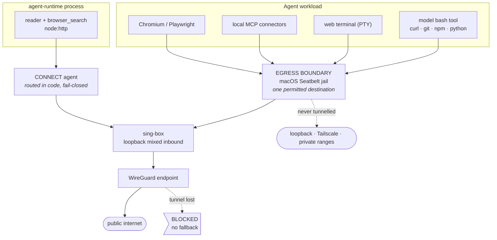

# Protected networking

Local Studio used to have a Browser toggle. It answered the wrong question.

Turning the browser off never removed the agent's internet. An agent in full
access could still reach the network through `bash`, `curl`, `wget`, Python,
Node, `git`, `npm`, an API, an MCP connector, or any subprocess it decided to
start. The switch described a **tool list** while appearing to describe a
**route**, so the owner had a control over the thing they did not care about and
no control over the thing they did.

The browser is now an ordinary capability, always available, and the model picks
between it and the shell on the merits. The switch that replaced it controls
routing:

> **VPN Protected** — while it is on, agent workloads have no permitted direct
> path to the public internet. Losing the tunnel blocks public egress until
> protection is restored.

Each claim below is labelled:

- **MEASURED** — observed on this machine, with the observation named.
- **IMPLEMENTED** — code that exists, with the file that holds it.
- **POLICY** — a decision, with its reason.
- **LIMITATION** — something this does not do.

---

## 1. What a VPN is not

A tunnel changes where packets leave from. It does not touch cookies, logins,
browser fingerprints, account identity, tokens, or any identifier the
application layer carries. A logged-in session is just as identified through a
tunnel as without one.

**POLICY.** The words *anonymous*, *untraceable* and *invisible* do not appear
in this feature's interface, and no code path implies them. The vocabulary is
*VPN Protected*, *VPN-only egress*, *exit IP*, *tunnel*, *DNS* and
*fail-closed*, because those are the things that are actually true.

---

## 2. The two modes

**Direct** — the default. Browser, browser search, Playwright, shell, APIs and
every tool are available, the model chooses among them, and traffic follows the
machine's normal route. Nothing is wrapped and nothing is intercepted.

**VPN Protected** — every one of those tools is *still* available and the model
still chooses among them. What changes is that any public-internet traffic
originating from a protected workload must traverse the protected route, and if
that route stops existing the traffic is blocked rather than re-routed.

The tool list is identical in both modes. Only the route differs.

---

## 3. Architecture



Five separate concerns, deliberately not one file:

| concern | file | what it owns |
|---|---|---|
| policy contract | `shared/agent/network-policy.ts` | the two policies, the six states, the three-valued observations |
| **enforcement** | `services/agent-runtime/src/network/jail.ts` | the boundary that makes escape impossible |
| tunnel | `services/agent-runtime/src/network/sing-box.ts` | config generation and process lifetime |
| provider | `services/agent-runtime/src/network/provider.ts` | WireGuard import, key storage |
| **attestation** | `services/agent-runtime/src/network/attestation.ts` | what a probe can observe — *not* security |
| orchestration | `services/agent-runtime/src/network/service.ts` | who is asking, the state machine, what to wrap |
| in-process egress | `services/agent-runtime/src/network/proxy-agent.ts` | the paths the jail cannot reach |

---

## 4. Enforcement is not a health check

These are separate on purpose, and conflating them is the usual way this feature
is built wrong.

**Enforcement** stops traffic. **Attestation** looks at traffic. The obvious
implementation — ask an exit-IP service what your address is and show a padlock
if it looks foreign — is telemetry wearing a firewall's clothes: it can be wrong
in both directions, it tells you nothing about the request that has not happened
yet, and it stops nothing.

**IMPLEMENTED.** `NetworkStatus.enforcement.failClosed` is read from whether the
jail exists. No probe contributes to it. The probes can only ever *downgrade*
the claim.

---

## 5. The boundary

**IMPLEMENTED.** `network/jail.ts`. The mechanism is the macOS Seatbelt sandbox,
applied per process with `sandbox-exec`. A jailed process may reach exactly one
network destination — the loopback port sing-box listens on — and nothing else.

Four properties are why:

1. **Inherited.** Every child, grandchild and `exec` is bound by it, so wrapping
   the shell wraps `curl`, `python`, `node`, `git`, `npm` and everything else at
   once.
2. **Cannot be widened from inside.** A nested `sandbox-exec` with a permissive
   profile fails with `sandbox_apply: Operation not permitted`.
3. **No privilege.** No root, no pf, no TUN device, no daemon, no entitlement.
4. **Fail-closed by construction, not by rule.** The only permitted destination
   *is* the tunnel. When the tunnel dies there is no second path to fall back
   to, because none was ever allowed. This is the difference between a
   kill-switch you have to implement correctly and one you cannot implement
   incorrectly.

### What was rejected, and why

**MEASURED — sing-box TUN with `auto_route`.** Needs root, and it is not a
boundary: an ordinary user can `setsockopt(IPPROTO_IP, IP_BOUND_IF, …)` onto any
interface and step around the routing table entirely. That succeeded here on
every interface present. `strict_route`, which mitigates it, is Linux/Windows
only.

**MEASURED — pf with a `group` rule.** Kernel-enforced, and it does cover IPv6.
But `pf_socket_lookup` only resolves credentials for TCP and UDP, so the rule is
structurally blind to ICMP — and unprivileged ICMP datagram sockets open fine on
this machine. It also matches the ids stored when a socket was *created*, so a
setuid binary creates sockets it cannot see; `/usr/sbin/traceroute` is setuid
root and world-executable.

**Environment variables** (`HTTP_PROXY` and friends) are set, but they are not
the boundary and are never treated as one. A process that ignores them gets
`EPERM` rather than a connection. They exist so that well-behaved tools take the
permitted path without being told, which is the difference between protected
mode *working* and protected mode merely *blocking*.

---

## 6. Coverage

| surface | how it is covered | kind |
|---|---|---|
| model `bash` tool (`curl`, `git`, `npm`, `pip`, `ssh`, python scripts) | `shellPath` in the agent's own `settings.json` points at a shim that `exec`s `sandbox-exec` | kernel |
| the web app's terminal (agent-runtime PTY) | spawn wrapped | kernel |
| local MCP stdio connectors | spawn wrapped | kernel |
| Chromium — headless, headful, `browser_verify` | `executablePath` points at an exec shim; Playwright's `proxy` option supplies `--proxy-server` | kernel |
| page JS, XHR, fetch, WebSockets | inside the Chromium process, therefore inside its jail | kernel |
| subagents | in-process sessions whose tools spawn through the wrapped sites | kernel |
| `browser_search`, reader (`fetchReadable`, `fetchPublicDocument`) | CONNECT agent in `proxy-agent.ts`; refused outright when the tunnel is down | **code** |
| remote (HTTP) MCP connectors | refused while protection is on | **refused** |
| the desktop app's own terminal (Electron PTY) | not confined — see §10.6 | **none** |

The last row is the honest one. See §10.

---

## 7. Session policy and Run policy

**POLICY.** The preference belongs to the conversation. Chat A can be Protected
while Chat B is Direct, and each remembers its own setting.

**POLICY.** A Run captures the policy of the conversation that created it, at
birth, and keeps it until it ends. Moving the toggle afterwards starts the *next*
Run somewhere else; it does not re-route work already in flight.

```
Chat: Protected ON
  └── Run A created            → Protected
Chat switched to Direct
  ├── Run A                    → still Protected
  └── Run B created            → Direct
```

**IMPLEMENTED.** `agentic_runs.network_policy`, a durable column. It survives
tasks, agents, subagents, compaction, resume, an agent-runtime restart, a
Local Studio restart, plan revision, backend outage, crash recovery and
reconciliation, because it is a column and none of those rewrite it.

The store had no way to add a column — every table is `CREATE TABLE IF NOT
EXISTS`, which does nothing to a table that already exists. An explicit additive
migration was added (`PRAGMA table_info` then `ALTER TABLE ADD COLUMN`,
idempotent). Rows predating the column backfill to `direct`: claiming a
guarantee that nothing ever provided would be worse than the missing field.

---

## 8. Isolation is conservative, not per-session

**LIMITATION, and it is stated in the interface as well as here.**

The agent-runtime is **one Node process** shared by every conversation. Sessions
are objects in a `Map`, subagents are more objects in the same `Map`, and the
browser host, Playwright manager and connector pool are process-global
singletons. Per-session env is applied by mutating `process.env`. There is
therefore no honest way to give conversation A a different route from
conversation B.

**POLICY — protected wins.** While *any* session or *any* live Run asks for
protection, the boundary is up and every agent-spawned process goes through the
tunnel, including those belonging to conversations set to Direct.

This is an accepted cost:

- Acceptable: a Direct conversation temporarily using the VPN.
- **Not** acceptable: a Protected workload occasionally using the direct route.

When it applies, the UI says so rather than hiding it.

---

## 9. States

| state | meaning |
|---|---|
| `DIRECT` | protection not requested |
| `STARTING` | requested, tunnel coming up — **egress already blocked** |
| `PROTECTED` | enforcement active, tunnel healthy, attestation sufficient |
| `DEGRADED` | boundary intact, measurement incomplete — never rendered as protected |
| `BLOCKED` | protection required, tunnel unavailable, public egress refused |
| `ERROR` | invalid configuration or an unrecoverable failure |

**POLICY.** The jail is written and the state leaves `DIRECT` **before** the
tunnel is asked to start. During the whole window in which the tunnel is coming
up, protected work is refused rather than let out directly. A boundary built
after the traffic starts is not a boundary.

**POLICY.** Absence of a measurement is `unavailable`, never `protected`. Every
observation is three-valued for exactly this reason. `unknown → Protected` is
the failure mode this design exists to make impossible.

---

## 10. What is not covered

Stated plainly, surfaced in the status popover as `unconfinedPaths`, and not
rounded up.

1. **In-process HTTP is routed in code, not confined by the kernel.** The reader
   and search client run inside the agent-runtime process, which cannot be
   jailed — it has to keep reaching the local controller and a model backend
   that may live on Tailscale, and a jail permitting those would permit most of
   the machine. They are fail-closed the same way (the request goes through the
   tunnel or is not sent), but that is enforced by code discipline rather than
   by the kernel.
2. **A socket connected before the jail and passed in as a file descriptor stays
   writable.** Seatbelt hooks `connect`/`sendto`/`bind`, not `write` on an
   established socket. This requires a cooperating unjailed helper; the runtime
   does not pass descriptors into jailed children.
3. **Chromium runs `--no-sandbox` under protection.** Its own Seatbelt sandbox
   cannot initialise inside ours. This trades Chromium's defence against hostile
   page content for the egress boundary.
4. **`sandbox-exec` is formally deprecated by Apple.** It works on Darwin 27 and
   is the same facility Chromium itself uses, but it is not a contract Apple has
   promised to keep.
5. **The desktop app's native terminal is not confined.** `frontend/desktop/logic/pty-manager.ts` spawns a shell in the Electron process, which has no access to the network service — that lives in the agent-runtime, a different process. It is the owner's own interactive terminal, driven by `terminal-panel.tsx`; no agent tool writes into it, and the model's own shell is a different path that *is* jailed. But if the owner types `curl` there while a conversation is protected, that request leaves on the machine's normal route. The web app's terminal, which shares the agent-runtime, is covered.

6. **A jailed helper would not fix §10.1.** Moving the reader and search into a Seatbelt-jailed helper process was prototyped and rejected on measurement, not taste: the jail constrains which socket the helper may open, and says nothing about what it asks the proxy to do once open. A jailed prototype reached a loopback service by sending `CONNECT localtest.me:9911`. Because `getaddrinfo` is denied inside the jail, only the unjailed parent can resolve and vet, so `publicResolvedAddresses()`, the address pin, the byte cap and the per-hop redirect re-vetting all stay code discipline either way — just one IPC boundary further from the socket they guard, at +76ms per hop and one spawn per redirect. See §13.

7. **No remote provider exit has been verified here.** See §13.

---

## 11. Localhost, Tailscale and private ranges

Protected mode must not break the product. Loopback, link-local, RFC 1918 and
the RFC 6598 range Tailscale uses (`100.64.0.0/10`) are routed direct and never
tunnelled. These are the only exceptions, they are all private, and none is a
path to the public internet.

`route.auto_detect_interface` is **false**. With it true, sing-box binds direct
dials to the physical interface and a connection to a Tailscale peer times out
rather than failing loudly — which would look exactly like the model backend
being down.

---

## 12. IPv4, IPv6 and DNS

- **IPv4** — attested only when a full request and response completed through
  the tunnel.
- **IPv6** — measured when the tunnel carries `::/0`; reported `blocked` when it
  does not. `blocked` is an *enforcement* claim, not an observation: the jail
  permits no direct destination, so a v6 packet has nowhere to leak to. "IPv4
  through the tunnel, IPv6 through the Wi-Fi" is the classic split, and blocking
  is the correct outcome rather than a degraded one.
- **DNS** — resolved through the tunnel only. There is no local fallback server,
  because a fallback is a leak: a name looked up on the ISP's resolver has
  already told them where the traffic is going. Inside the jail `getaddrinfo`
  is denied outright, so names resolve at the far end or not at all.

---

## 13. The acceptance run

```
npm run test:network-protection
```

Not a unit test, not wired into `npm run check`, CI or a git hook. Every claim
here is about what the operating system does, and none of it survives mocking
the operating system.

The load-bearing check is not "did the request succeed" but whether the address
the world sees for a protected workload is the same one it sees when this
machine talks directly. The direct address is measured **first**, before
protection exists. Addresses are masked to two octets; no secret is printed.

**MEASURED** on this machine against a real WireGuard tunnel (a local sing-box
peer), Darwin 27, Apple Silicon:

```
shell/curl                INCONCLUSIVE  tunnel exits on this host
python                    INCONCLUSIVE  tunnel exits on this host
node                      INCONCLUSIVE  tunnel exits on this host
git/CLI                   INCONCLUSIVE  tunnel exits on this host
DNS                       PASS  protected
IPv4                      PASS  protected
IPv6                      PASS  protected
fail-closed enforced      PASS  macos-seatbelt
kill switch: curl         PASS  blocked
kill switch: direct curl  PASS  blocked
kill switch: raw socket   PASS  blocked
kill switch: state        PASS

Direct IP while protected: not assessable — the configured peer exits on this host
```

`INCONCLUSIVE` is deliberate. Those four probes did reach the internet through
the WireGuard tunnel, but the local test peer egresses from this same host, so
the exit address equals the direct address by construction. That is
indistinguishable from a leak *by address alone*, so it is reported as
inconclusive rather than as a pass it has not earned. With a remote provider it
resolves either way.

Measured separately, by hand, with a live loopback proxy:

| probe | result |
|---|---|
| jailed `curl` direct | fails, exit 6 |
| jailed `curl` via proxy | 200 |
| jailed `getaddrinfo` | dies |
| jailed raw socket to a literal address | `EPERM` |
| jailed connect to a *different* loopback port | `EPERM` |
| jailed connect to the permitted port | `ECONNREFUSED` (allowed, nothing listening) |
| Playwright + Chromium via proxy | full page |
| Playwright + Chromium without proxy | `ERR_NAME_NOT_RESOLVED` |
| Playwright + Chromium, **tunnel killed** | `ERR_PROXY_CONNECTION_FAILED` — never a direct load |
| `node -e fetch(...)` via proxy | 200 |
| `git ls-remote` via proxy | refs returned |

**The most important one**, run with work in flight: killing sing-box left the
proxy path failing (exit 7), the direct path failing with an **empty body**, and
a raw socket to a literal IP at `EPERM`. **No direct fallback was observed.**

---

## 14. Setup

Protected mode needs two things and refuses to claim protection without both.

1. **sing-box.** Found at `~/.local/bin/sing-box`, `/opt/homebrew/bin/sing-box`,
   `/usr/local/bin/sing-box`, or wherever `LOCAL_STUDIO_SING_BOX_PATH` points.
2. **A WireGuard configuration** from your provider's dashboard — Proton,
   Mullvad, IVPN or any other. Import it once from the network control.

**POLICY — a config file, not a vendor API.** A provider's internal login and
server-list endpoints are undocumented, unversioned and change without notice; a
security boundary built on one breaks when they ship. A `.conf` file is stable,
documented and supported, and this works with any WireGuard provider.

A split `AllowedIPs` is **refused at import**. A destination outside the tunnel
is precisely the silent direct-fallback path this feature exists to remove.

### Secrets

Private keys and preshared keys are validated for shape, stored `0600` inside
the `0700` data directory, and never leave the process: not in the status
contract, not sent to the frontend, not put in the model's context, not logged,
not in an error message, and redacted out of sing-box's own stderr. The config
is written to a file rather than passed on the command line, where it would be
readable in the process table.

`describeProvider()` — name, endpoint host and port, whether the tunnel is full,
DNS count — is the only view that leaves the process.

---

## 15. Troubleshooting

**"no VPN configuration has been imported"** — import one. Asking for protection
without a configuration is refused with a 409 rather than accepted into an error
state, because a toggle that switches on and then sits red teaches you that the
padlock is decorative.

**Stuck at `STARTING`, then `BLOCKED`** — the tunnel is listening but nothing
completes through it. Usually an unreachable peer, a wrong key, or a firewall in
front of the endpoint. The status detail says which.

**`DEGRADED`** — the boundary is up and traffic is confined, but the exit
address could not be read. Nothing is leaking; the claim is just weaker than
`PROTECTED`, and the UI will not pretend otherwise.

**A tool works in Direct and hangs in Protected** — it is probably resolving
names locally. `getaddrinfo` is denied inside the jail by design. Use the proxy
environment (`HTTPS_PROXY`, or `socks5h://` for SOCKS) so names resolve at the
far end.

**Node `fetch` fails** — Node ignores `HTTP_PROXY` unless `NODE_USE_ENV_PROXY=1`,
which protected mode sets. That variable decides whether protected mode is
*usable* from Node, not whether it is *safe*.

**Tailscale unreachable** — should not happen; `100.64.0.0/10` is routed direct.
If it does, check that `auto_detect_interface` is still `false`.

**Turning it off** — when no session or Run still asks for protection, the
tunnel is stopped, the shim is removed from the agent's settings, and the shell
returns to the SDK's own resolution. No pf rule, no firewall state, no DNS
change and no daemon is left behind, because none was ever created.

---

## 16. Related

- [`docs/durable-agentic-runtime.md`](durable-agentic-runtime.md) — the Run
  model this policy attaches to.
- [`docs/web-search.md`](web-search.md) — the search and reader paths.
